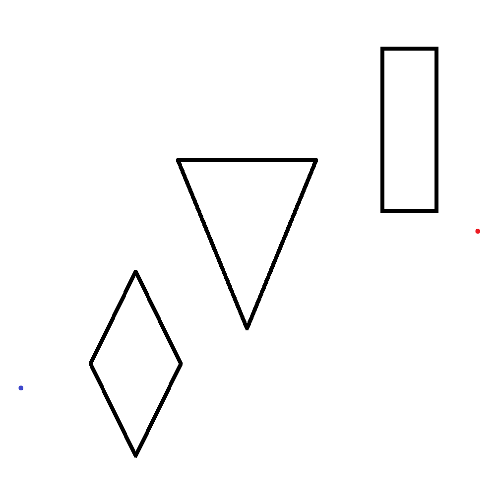

# Lista-Pratica-Grafos-2

## Parte 1 & 2: Criação e Leitura de Mapa e Grafo de Visibilidade
Estes módulos são responsáveis por digitalizar o ambiente e estabelecer as conexões possíveis para navegação.

### Imagem do mapa (Paint)

Sendo o ponto azul o Start e o ponto vermelho o End.

### Formato do Arquivo de Mapa (`.txt`)
O sistema aceita mapas definidos em arquivos de texto plano contendo as coordenadas de início, fim e os vértices dos obstáculos poligonais.

**Especificação do formato:**
```txt
start_x, start_y      # Coordenada inicial
end_x, end_y          # Coordenada de destino
N                     # Número total de obstáculos
V1                    # Número de vértices do obstáculo 1
x1, y1                # Vértice 1
x2, y2                # Vértice 2

Mapa:
41, 220
962, 536
3
4
273, 83
183, 267
273, 451
363, 267
3
497, 341
360, 676
635, 676
4
771, 577
771, 901
879, 901
879, 577
```

### Geração do Grafo de Visibilidade
O núcleo da navegação é um **Grafo de Visibilidade**, onde cada nó é um vértice de obstáculo (ou os pontos inicial/final) e cada aresta representa uma linha de visão desobstruída.


**Tecnologias utilizadas:**
* **`shapely`**: Para manipulação geométrica robusta. Os obstáculos são convertidos em objetos `Polygon` e as possíveis conexões em `LineString`.
* **`networkx`**: Para estruturar e armazenar o grafo resultante.

**Lógica de Conexão:**
Para cada par de vértices no mapa, um segmento de reta é criado. Este segmento é validado contra todos os obstáculos. Uma aresta é adicionada ao grafo se, e somente se, o segmento **não interceptar o interior** de nenhum polígono.

```python
# Trecho simplificado da lógica de validação
if line.intersects(poly) and not line.touches(poly):
    # Bloqueado: a linha cruza o interior do obstáculo
    visivel = False
else:
    # Visível: a linha passa livre ou apenas tangencia a borda
    visivel = True
