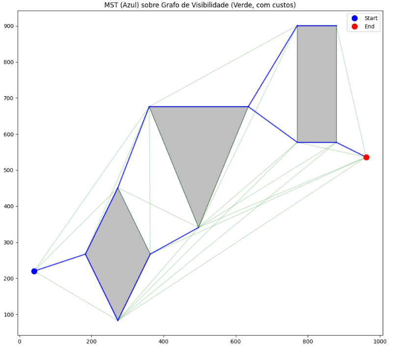
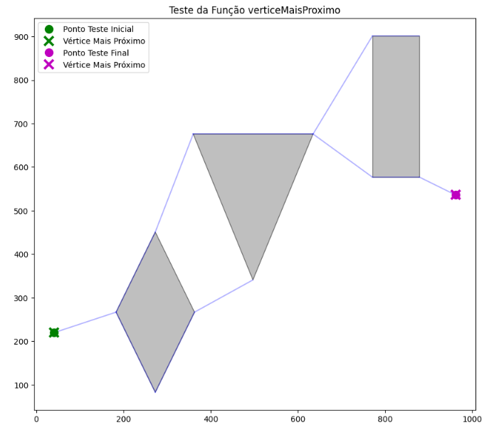
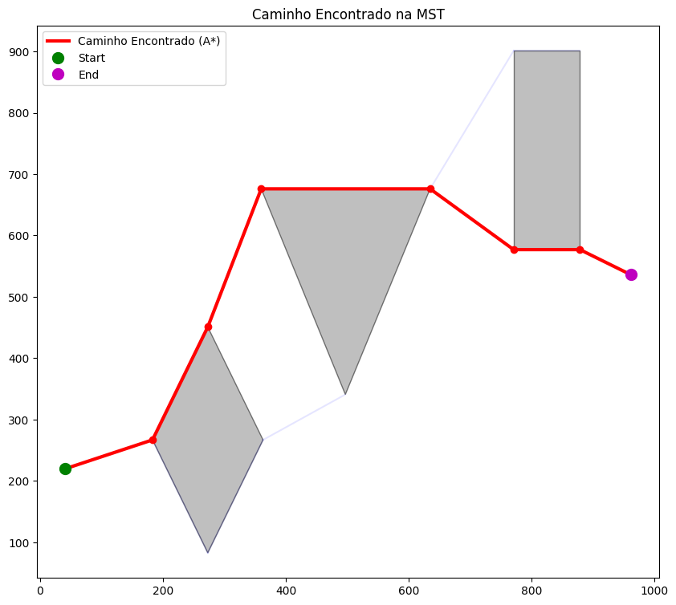

# Lista-Pratica-Grafos-2

## Parte 1 & 2: Criação e Leitura de Mapa e Grafo de Visibilidade
Estes módulos são responsáveis por digitalizar o ambiente e estabelecer as conexões possíveis para navegação.

### Imagem do mapa (Paint)

Sendo o ponto azul o Start e o ponto vermelho o End.

### Formato do Arquivo de Mapa (`.txt`)
O sistema aceita mapas definidos em arquivos de texto plano contendo as coordenadas de início, fim e os vértices dos obstáculos poligonais.

**Especificação do formato:**
```txt
start_x, start_y      # Coordenada inicial
end_x, end_y          # Coordenada de destino
N                     # Número total de obstáculos
V1                    # Número de vértices do obstáculo 1
x1, y1                # Vértice 1
x2, y2                # Vértice 2

Mapa:
41, 220
962, 536
3
4
273, 83
183, 267
273, 451
363, 267
3
497, 341
360, 676
635, 676
4
771, 577
771, 901
879, 901
879, 577
```

### Geração do Grafo de Visibilidade
O núcleo da navegação é um **Grafo de Visibilidade**, onde cada nó é um vértice de obstáculo (ou os pontos inicial/final) e cada aresta representa uma linha de visão desobstruída.


**Tecnologias utilizadas:**
* **`shapely`**: Para manipulação geométrica robusta. Os obstáculos são convertidos em objetos `Polygon` e as possíveis conexões em `LineString`.
* **`networkx`**: Para estruturar e armazenar o grafo resultante.

**Lógica de Conexão:**
Para cada par de vértices no mapa, um segmento de reta é criado. Este segmento é validado contra todos os obstáculos. Uma aresta é adicionada ao grafo se, e somente se, o segmento **não interceptar o interior** de nenhum polígono.

# Trecho simplificado da lógica de validação
if line.intersects(poly) and not line.touches(poly):
    # Bloqueado: a linha cruza o interior do obstáculo
    visivel = False
else:
    # Visível: a linha passa livre ou apenas tangencia a borda
    visivel = True

# Passo 3: Árvore Geradora Mínima (MST)

Após a criação do Grafo de Visibilidade (com todos os atalhos), o próximo passo foi implementar um algoritmo para extrair uma **Árvore Geradora Mínima (MST)** desse grafo.

### MST

A MST (Minimum Spanning Tree) é um subconjunto das arestas do grafo original que conecta **todos** os vértices (quinas, início e fim) sem formar ciclos, e com o menor custo (distância) *total* possível. Ela funciona como um "esqueleto" ou a rede de estradas principal do mapa.

### Implementação (Algoritmo de Kruskal)

Utilizamos o algoritmo de **Kruskal**, disponível na biblioteca `networkx`, para gerar a MST a partir do `grafo_vis`. O algoritmo de Kruskal ordena todas as arestas (atalhos) do menor custo para o maior e as adiciona na árvore, desde que elas não formem um ciclo.

```python
#Função da biblioteca networkx para gerar a MST
mst = nx.minimum_spanning_tree(grafo_vis, algorithm='kruskal')
```



# Resultado (Passo 4)
O gráfico de teste demonstra a função. Os pontos "Start" e "End" (que já são vértices) são corretamente identificados como os mais próximos de si mesmos (o "O" e o "X" se sobrepõem).




# Passo 5 & 6: Busca na Árvore (A*) e Caminho Final

Com a MST "esqueleto" gerada, o passo final foi encontrar o caminho mais curto *dentro dessa árvore* entre o início e o fim.

### Implementação (Algoritmo A*)

Foi implementada a função `encontrar_caminho_na_arvore` utilizando o algoritmo **A* (A-star)** da biblioteca `networkx`.

* **Função:** `nx.astar_path(arvore_mst, source=no_inicial, target=no_final, heuristic=heuristic_dist)`
* **Entrada:** Recebe os vértices inicial e final (determinados no Passo 4) e a MST (do Passo 3).
* **Heurística:** Utiliza a **distância Euclidiana** (`math.dist`) como heurística para guiar a busca de forma eficiente.
* **Custo:** O custo real para o A* é o atributo `weight` (distância) de cada aresta da MST.

Uma verificação de robustez foi incluída para converter os tipos de dados `np.float64` (retornados pelo *verticeMaisProximo*) para as tuplas `(float, float)` exatas usadas como nós no grafo.

### Resultado (Passo 6)

A função `plotar_caminho` foi executada para exibir o resultado final. O gráfico gerado (salvo como `caminho_mst.png`) mostra:
1.  Os obstáculos (cinza).
2.  A MST completa (em azul claro, ao fundo).
3.  O caminho final encontrado pelo A* (em vermelho vivo).

O teste, buscando do "Start" (41.0, 220.0) ao "End" (962.0, 536.0), encontrou com sucesso um caminho composto por 8 vértices.




